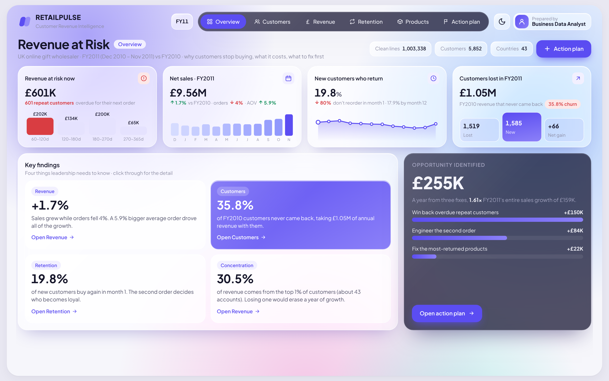

# Revenue at Risk — Customer Revenue Intelligence for a UK Online Retailer

**One question:** why do customers stop buying, what does it cost, and what should the business fix first?

**One answer:** £601K of annual revenue sits with 601 repeat customers who are overdue for their next order, 35.8% of last year's customers never came back, and three targeted fixes are worth **£255K — 1.6× this year's entire sales growth.**

**Live dashboard:** https://Aimalkhanj.github.io/Revenue-at-risk/



---

## 1. Business problem

The retailer grew net sales only **1.7%** in FY2011 (£9.56M). Leadership wants to know whether growth is healthy, where revenue is leaking, and which actions will pay back fastest.

**Business questions**
1. Is growth coming from more customers, more orders, or bigger orders?
2. How many customers come back after their first purchase, and when do we lose them?
3. Which customers are drifting away right now, and how much are they worth?
4. How concentrated is revenue? What happens if a key account leaves?
5. Does the first order predict long-term value?
6. Which products leak value through returns?
7. Which markets and product combinations are growth levers?

## 2. Data

| | |
|---|---|
| Source | UCI Machine Learning Repository — *Online Retail II* (Chen, 2019) |
| Business | UK-based online gift retailer; many customers are wholesalers |
| Period | 1 Dec 2009 – 9 Dec 2011 |
| Size | 1,067,371 transaction lines · 5,852 identified customers · 4,723 products · 43 countries |
| Columns | Invoice, StockCode, Description, Quantity, InvoiceDate, Price, Customer ID, Country |

Analysis uses a **Dec–Nov fiscal year** so both years are complete: FY2010 = Dec 2009–Nov 2010, FY2011 = Dec 2010–Nov 2011.

## 3. Data cleaning (documented in `data/cleaning_log.csv`)

| Rule | Rows removed |
|---|---|
| Exact duplicate rows | 34,335 |
| Cancellation invoices (prefix C) → moved to a separate returns table | 19,104 |
| Bad-debt adjustments (prefix A) | 6 |
| Non-product codes (POST, DOT, M, BANK CHARGES, AMAZONFEE, samples…) | 4,623 |
| Zero or negative quantity / price | 5,963 |
| Two giant test orders (74,215 and 80,995 units) cancelled within minutes — removed from both sales and returns | 2 + 2 |

Result: **1,003,338 clean sales lines**. 22.6% of lines have no Customer ID (guest checkouts); they are kept for revenue KPIs and excluded from customer-level analysis.

## 4. Tools and pipeline

| Layer | Tool |
|---|---|
| Storage & modelling | **SQL on DuckDB** (`sql/kpis_and_cohorts.sql`): fact_orders, dim_customer, cohort retention, KPIs |
| Analysis | **Python** — pandas, NumPy, SciPy (chi-square test) |
| Segmentation | RFM quintile scoring → 8 business segments |
| Market basket | Pair support, confidence and lift |
| Dashboard | HTML/SVG single-frame dashboard (no BI licence needed); same design can be rebuilt in Power BI or Tableau |

```
src/01_load_and_clean.py      load both Excel sheets, validate, clean, log every rule
sql/kpis_and_cohorts.sql      core SQL models
src/02_analysis.py            runs the SQL + all analyses → data/outputs/*.csv, data/dashboard_data.json
src/03_build_dashboard.py     injects results into dashboard/template.html
dashboard/revenue-at-risk.html  the finished dashboard (open in any browser)
index.html                    same dashboard, served as the live GitHub Pages site
```

**Run it**
```bash
pip install pandas pyarrow openpyxl duckdb scipy
# place online_retail_II.xlsx in data_raw/
python src/01_load_and_clean.py
python src/02_analysis.py
python src/03_build_dashboard.py
```

## 5. Key findings

**Growth is fragile.** Net sales +1.7%, but orders −4.0%. All growth came from a 5.9% larger average order (£504). Repeat purchasing within the year slipped from 66.4% to 63.9% of customers.

**The business is running to stand still.** 1,519 FY2010 customers (35.8%) never returned, taking £1.05M of annual revenue. 1,585 new customers replaced them — a net gain of just 66.

**The second order is where loyalty is won or lost.** Only ~20% of genuinely new customers buy again in any given month after their first purchase (cohort analysis). The existing base still buys at 37.6% a year later.

**601 repeat customers are overdue right now.** Their silence is more than twice their own usual reorder gap. They hold **£601K of annual value (7.3% of trailing revenue)**; £202K of it is in customers silent only 60–120 days — still very winnable.

**Revenue is highly concentrated.** The top 1% of customers (~43 accounts) generate 30.5% of revenue; the top 20% generate 73.8%; the top 10 accounts 16.7%. Champions are 27% of customers and 72% of lifetime revenue.

**The first order predicts loyalty.** Customers whose first order is in the top quartile reorder within 12 months 83.8% of the time vs 64.6% for the smallest quartile (χ² p < 0.001, n = 4,285). A repeater is worth a median £1,282 in year one; a one-time buyer £228.

**Seasonality is extreme.** Sep–Nov delivers 37.5% of annual sales. Orders peak Tuesday ~15:00; Thursday and Tuesday are the biggest days; there is no Saturday trading.

**Returns are low overall but concentrated.** Returns are 2.3% of gross sales (£225K), down from 2.5%. A handful of items fail badly — e.g. Pantry Chopping Board loses 45% of sales value to returns.

**Markets.** UK = 84.5% of sales. France +41%, Australia +365% (small base); Ireland −25%, likely a few large accounts going quiet.

**Bundles.** Party paper cups + plates (lift 47×, 82% confidence) and the Feltcraft range sell as collections.

## 6. Recommendations and money impact

| # | Action | Annual impact | Assumption |
|---|---|---|---|
| 1 | Win back overdue repeat customers (weekly overdue list, call the top 100, automated reminder at 2× usual gap) | **+£150K** | Recover 25% of £601K overdue annual value |
| 2 | Engineer the second order (offer within 30 days, bigger first baskets via bundles) | **+£84K** | +5 pts of 1,585 new customers reorder; each repeater is worth £1,054 more in year one |
| 3 | Fix the most-returned products (descriptions, photos, supplier QC, delist above 20% return rate) | **+£22K** | Halve returns on the 8 products behind 19.2% of returned value |
| | **Total** | **£255K** | **1.6× FY2011 sales growth (£159K)** |

Also: put a named account manager on the top 1% of customers — losing one of them would erase a year's growth.

## 7. Limitations

- Data ends in Dec 2011 and comes from one retailer; figures illustrate the method, not today's market.
- Guest checkouts (no Customer ID) can't be tracked for retention.
- Impact estimates are scenario-based with stated assumptions, not causal measurements. The next step would be an A/B test of the win-back and second-order offers.
- RFM thresholds are quintile-based and relative to this customer base.

## 8. Data citation

Chen, D. (2019). *Online Retail II* [Dataset]. UCI Machine Learning Repository. https://doi.org/10.24432/C5CG6D
